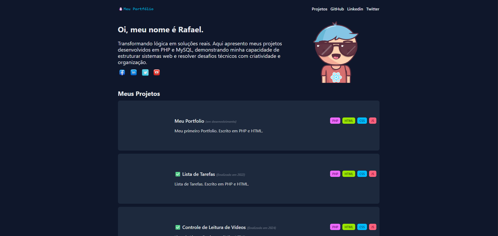

<div align="center">

# 🚀 Portfolio with PHP and TailwindCSS

A modern, responsive, and dynamic portfolio built with pure PHP and styled with TailwindCSS.

[](https://php.net/)
[](https://tailwindcss.com/)
[](LICENSE)

</div>

<div align="center">
  
</div>

---

## 📖 Overview

This project is a complete refactoring of a legacy portfolio. The goal was to modernize the tech stack, moving from old procedural PHP to a component-based structure, maintaining the simplicity of **Vanilla PHP** but with the visual power of **TailwindCSS**.

### ✨ What Changed?

- **Frontend**: Full migration to **TailwindCSS** (via CDN for rapid development).
- **Backend**: Modern PHP serving as a template engine.
- **Structure**: Separation of concerns in `components/` (Header, Hero, Projects).
- **Assets**: Organized management of images and dynamic SVG icons.
- **Workflow**: Automated scripts for semantic commits in WSL.

---

## 🛠️ Technologies

- **PHP 8.2+**: Rendering logic and data.
- **TailwindCSS 3.4**: Utility-first styling.
- **Semantic HTML5**: Accessible and SEO-friendly structure.
- **Git Flow & Conventional Commits**: Versioning standard.

---

## 🚀 Project Structure

```bash
├── 📁 .agent/          # Automation workflows (AI)
├── 📁 components/      # Reusable UI components
│   ├── header.php
│   ├── hero.php
│   └── projects.php
├── 📁 img/             # Assets (Images, Icons, SVG)
├── index.php           # Entry Point (Main Layout)
└── README.md           # Documentation
```

---

## ⚡ How to Run

### Prerequisites
- PHP 8.0 or higher installed.

### Step-by-Step

1. **Clone the repository:**
   ```bash
   git clone https://github.com/rafaumeu/portifolio_php.git
   cd portifolio_php
   ```

2. **Start the Built-in Server:**
   ```bash
   php -S localhost:8000
   ```

3. **Access:**
   Open `http://localhost:8000` in your browser.

---

## 🎨 Customization

### Adding New Projects
Go to `components/projects.php` and add to the `$projects` array:

```php
[
    "titulo" => "New Project",
    "finalizado" => true,
    "ano" => 2025,
    "descricao" => "Amazing description...",
    "stack" => ["PHP", "Laravel"],
    "img" => "img/new-project.png"
]
```

---
<div align="center">
Developed with 🐧 during Rocketseat's course
</div>
<div align="center">


[](https://www.linkedin.com/in/rafael-dias-zendron-528290132/)
[](https://github.com/rafaumeu)
</div>
